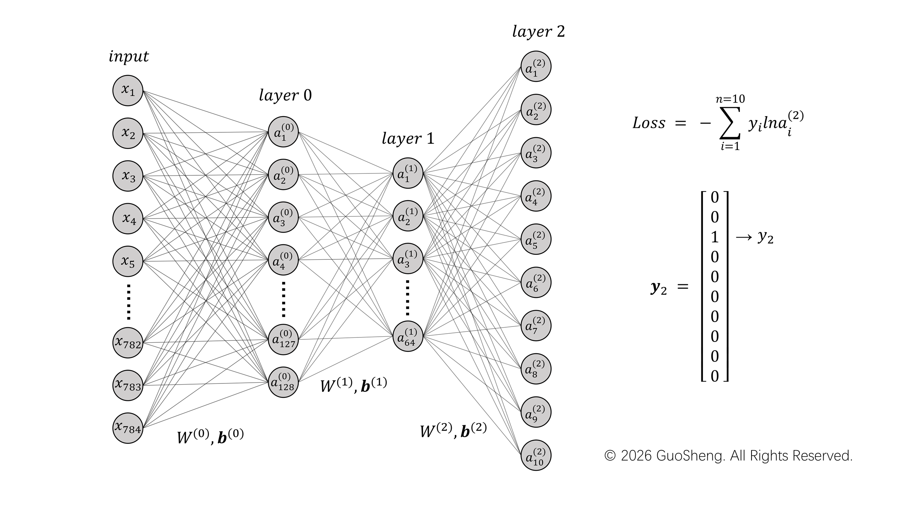
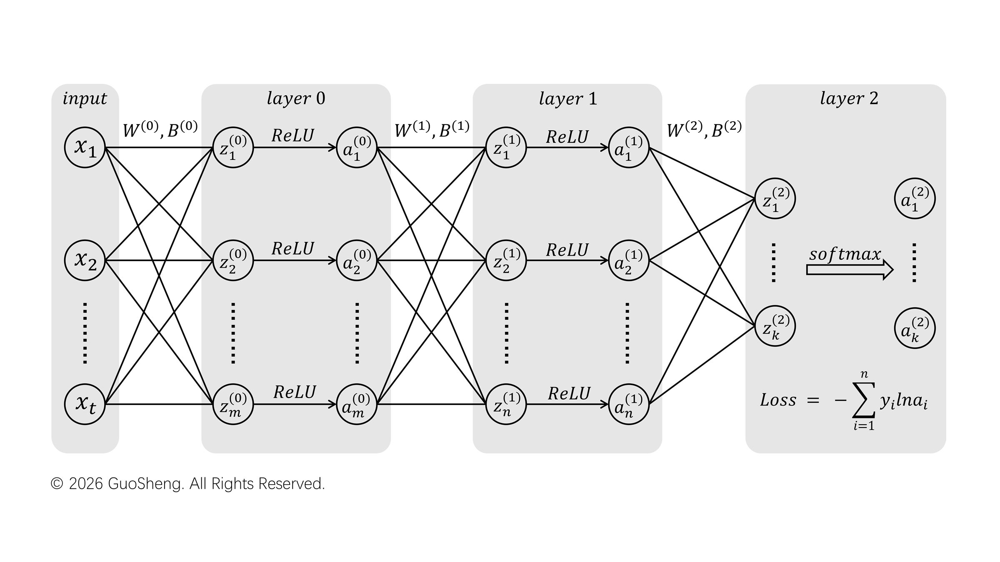

# 基于C语言的手写数字识别网络

## 概述

本项目是一个基于 C11 标准的的教学项目，旨在从零实现经典 MNIST 手写数字识别。除标准 C 库外，不依赖任何深度学习框架或第三方数值库。张量运算、前向传播、反向传播和梯度下降训练流程，均使用标准 C 手工实现。只要你的设备具备 C 程序的开发环境，便可很快复现本项目的实验现象。

本项目并非为了替代或挑战 PyTorch、TensorFlow 等成熟框架，而是面向希望深入理解神经网络底层原理的学习者。作者水平有限，代码以清晰、可读、可调试为目标，不追求生产级性能或最优准确率。希望本项目能对那些对深度学习底层原理的朋友提供一些帮助。本项目遵循 MIT 开源协议（详细条款请参阅 LICENSE），你可以自由使用、修改、分发本项目或用作商用目的，只需要保留版权声明和许可证声明即可。


## 特性

- **无外部依赖**：本项目中 Dense / ReLU / Softmax 的前向与反向、交叉熵损失、SGD 全部基于标准C语言实现，你可以很方便地逐层打断点验证。

- **训练 / 推理双模式**：在main函数中，实现了一个简单的训练/推理程序。你只需要修改改一个宏即可在两种模式间切换，训练模式会自动导出模型权重，推理模式直接加载权重、跳过训练，并直接开始推理。当然，你也可以通过本项目函数库中提供的函数，自由地设计你想要的模型结构并加以训练。但目前仅支持简单的MLP网络。后续将逐步跟进卷积层的开发。

- **权重导出成 C 头文件**：`src/weights.h` 是纯 C 数组，用于保存训练模式下产生的权重参数。如果你对嵌入式有所了解，希望能够在端侧完成推理，可以很方便的将生成的权重参数移植到你的嵌入式项目中。

- **错例可视化**：推理模式下，测试集中识别错误的样本会打印字符画 + 10 类概率分布，你可以直观地看到模型错在哪、分析神经网络背后一些列有趣的现象。

- **结果可复现**：在随即初始化权重参数阶段，你可以指定随机数种子；在参数导出阶段，你可以指定参数的导出精度。因此，你可以方便的控制变量，来重复调查不同参数配合下对模型性能的影响。

## 快速开始

### 环境要求

- Windows：推荐使用 mingw 配合工程中的 makefile 使用，只需要一行 make 命令或者 mingw64 make 即可完成编译，生成可执行的 main.exe 文件。
- Linux/MacOS：使用系统自带的 GCC 编译工具即可。
- C 语言环境需要支持 C11 标准。

### 数据集

MNIST 的 4 个 idx 文件（约 55 MB）**已随仓库提供**，位于 `data/` 目录，开箱即用，无需额外下载。

对于 Windows 用户，如需重新获取数据集（例如文件损坏），可以使用附带的脚本一键下载 + 解压 + 校验字节数：

```powershell
powershell -ExecutionPolicy Bypass -File scripts/download_mnist.ps1
```

默认走 googleapis 镜像（国内速度较好），网络不通畅时可换源：

```powershell
powershell -ExecutionPolicy Bypass -File scripts/download_mnist.ps1 -Source s3
```
若以上方法失效，你也可以直接访问 [MNIST 数据集官网](http://yann.lecun.com/exdb/mnist/)下载训练、测试所用的数据集。
### 编译
对于 Windows 用户，且安装了 mingw 编译工具的，可以使用以下命令一键完成编译。倘若编译报错或者提示缺少 makefile 文件，请检查当前目录下 makefile 文件确实存在且未被意外修改。
```bash
mingw32-make
```

或者不用 make，可以直接使用gcc工具完成编译：

```bash
# Windows
gcc src/*.c -std=c11 -O2 -Wall -o main.exe

# Linux / macOS 需要额外链接数学库
gcc src/*.c -std=c11 -O2 -Wall -o main -lm
```

> 需要注意的是，`Makefile` 内的 `clean` 目标使用了 Windows 的 `del` 命令，Linux 下改用上面的 gcc 一行命令即可。

### 运行

在终端中执行以下命令即可执行程序：

```bash
# Windows
./main.exe
# Linux/MacOS
./main
```

> 程序用相对路径读写 `data/` 和 `src/weights.h`，**请在项目根目录下执行该命令**。

默认是训练模式：载入训练集 → 训练 10 轮 → 把权重导出到 `src/weights.h` → 在测试集上评估并打印错例。

### 切换到推理模式

注释掉 [src/main.c:12](src/main.c#L12) 的宏定义，重新编译：

```c
// #define MODE_TRAIN
```

推理模式不再训练，而是直接加载 `src/weights.h` 后跑测试集，因此，在进入推理模式前，你必须确保你至少进行过一次训练、在weight.h中存储了有效的权重参数。

> 仓库里已附上一份训练好的 `src/weights.h`，所以拉下来就能直接体验推理模式，不必先等 50 秒训练。

## 运行效果

```text
=== Handwritten Digit Recognition ===
[MODE] Train mode on.
[INFO] MNIST_Train load successfully.
[INFO] Model init successfully.
[INFO] Train Start.
[EPOCH:10 | PIXEL:784 | TRAIN_SIZE:60000 | LR:0.0100]
epoch 01 | avgLoss:0.243139 | acc:92.58% | time:5.095s | (55549/60000)
epoch 02 | avgLoss:0.104272 | acc:96.89% | time:5.077s | (58133/60000)
epoch 03 | avgLoss:0.075386 | acc:97.64% | time:5.031s | (58585/60000)
epoch 04 | avgLoss:0.056358 | acc:98.22% | time:4.976s | (58933/60000)
epoch 05 | avgLoss:0.047600 | acc:98.44% | time:4.971s | (59063/60000)
epoch 06 | avgLoss:0.041017 | acc:98.68% | time:4.994s | (59207/60000)
epoch 07 | avgLoss:0.037908 | acc:98.85% | time:4.990s | (59311/60000)
epoch 08 | avgLoss:0.036149 | acc:98.80% | time:4.940s | (59280/60000)
epoch 09 | avgLoss:0.033731 | acc:98.89% | time:4.948s | (59336/60000)
epoch 10 | avgLoss:0.028947 | acc:99.03% | time:4.977s | (59418/60000)
[INFO] Weights saved to src/weights.h.
[INFO] MNIST_Test load successfully.
[INFO] Test start.
Test result:
acc:97.19% | avgLoss:0.129164 | time:0.374000s | (9719/10000)

==== Misclassified samples (show 8, total wrong = 281) ====

----- Sample #149 | true label: 2 | predicted: 4 (WRONG) -----
. . . . . . . . . . . . . . . . . . . . . . . . . . . . 
. . . . . . . . . . . . . . . . . . . . . . . . . . . . 
. . . . . . . . . . . . . . . . . . . . . . . . . . . . 
. . . . . . . . . . . . . . . . . . . . . . . . . . . . 
. . . . . . . . . . . . . . . . . . . . . . . . . . . . 
. . . . . . . . . . . . . . . . . . . . . . . . . . . . 
. . . . . . . . . . . . . : % # - . . . . . . . . . . . 
. . . . . . . . . . . . = # % * . . . . . . . . . . . . 
. . . . . . . . . . . . . . : % % . . . . . . . . . . . 
. . . . . . . . . . . . . . . : % : . . . . . . . . . . 
. . . . . . . . . . . . . . . . # = . . . . . . . . . . 
. . . . . . . . . . = * + : . . # . . . . . . . . . . . 
. . . . . . . . - % % # # % % # * . . . . . . . . . . . 
. . . . . . . : + = . . . : % % * . . . . . . . . . . . 
. . . . . . : % : . . . . - % # % % . . . . . . . . . . 
. . . . . . # # . . . . : % # . : # % . . . . . . . . . 
. . . . . . * - . . . . % # . . . . # # . . . . . . . . 
. . . . . . . # : . : # # . . . . . . # # . . . . . . . 
. . . . . . . = % * % # . . . . . . . . % * . . . . . . 
. . . . . . . . * # - . . . . . . . . . : % # . . . . . 
. . . . . . . . . . . . . . . . . . . . . . % * . . . . 
. . . . . . . . . . . . . . . . . . . . . . - % - . . . 
. . . . . . . . . . . . . . . . . . . . . . . - % : . . 
. . . . . . . . . . . . . . . . . . . . . . . . * # . . 
. . . . . . . . . . . . . . . . . . . . . . . . . . . . 
. . . . . . . . . . . . . . . . . . . . . . . . . . . . 
. . . . . . . . . . . . . . . . . . . . . . . . . . . . 
. . . . . . . . . . . . . . . . . . . . . . . . . . . . 
prob:  [0]:0.0001   [1]:0.0166   [2]:0.0325   [3]:0.0183   [4]:0.5104* 
       [5]:0.0014   [6]:0.0002   [7]:0.0009   [8]:0.0065   [9]:0.4131
```

（字符画中 `%` `#` 表示笔迹较深，`.` 表示背景）

程序在结束时输出了测试集中一个判断失误的实例：该数字下半部分有个闭合的圈，模型把它当成了 4（0.51）而不是 2（0.03）——但它其实也很犹豫（9 的概率高达 0.41）。这是因为**全连接网络把图片压缩成一维向量后作为输入，丢掉了笔划相对位置的空间信息**，所以对这种结构上的歧义没什么抵抗力。这正是卷积神经网络试图解决的问题。

## 网络结构



本项目实际实现的网络：输入 784 维像素（28×28 压平），经两层 ReLU 全连接层，最后由 10 类 Softmax 输出概率分布。右侧是交叉熵损失与 one-hot 形式的标签向量 `y`。



上图把每个神经元拆成两步来看：`z` 是加权求和（`z = Wx + b`），`a` 是过激活函数之后的输出（`a = f(z)`）。这个区分在代码里是一条硬约定——[layer.h](src/layer.h) 中 `Layer.activation_value` 存的是 `a`，`Layer.delta` 存的是损失对 `z` 的偏导 `∂L/∂z`，相邻两层之间的误差信号就是靠它往回传的。

- 权重初始化：均匀分布 `[-1/√n, 1/√n]`，固定随机种子 `srand(50)`
- 损失函数：交叉熵，反传时用 softmax + 交叉熵的联合梯度 `∂L/∂z = p − y`
- 优化器：单样本 SGD，学习率 0.01
- 训练 10 轮后训练集准确率 99.03%、测试集 97.19%，存在轻微过拟合，属正常范围

## 项目结构

```text
Handwritten_digit_recognition/
├── Makefile                    
├── README.md                   
├── 调参指南.txt               
├── 手写数字识别调参指南.pdf    
├── docs/                       # 文档使用的资源
├── data/                       # MNIST 数据集（4 个 idx 文件，已随仓库提供）
├── weights/                    # 预留：后续二进制模型文件目录
├── scripts/
│   └── download_mnist.ps1      # 数据集下载 / 解压 / 校验脚本
└── src/
    ├── main.c                  # 一个训练/推理例程
    ├── tensor.c / .h           # Tensor 结构体（行优先连续内存）与基础操作
    ├── data.c   / .h           # MNIST idx 格式读取、ASCII 字符画渲染
    ├── layer.c  / .h           # Dense / ReLU / Softmax 前向与反向、交叉熵、SGD
    ├── model.c  / .h           # 网络组装、tensor 池管理、权重导出与回读
    └── weights.h               # 训练生成的权重（C 数组，已随仓库提供）
```


## 文档
对于对神经网络不太熟悉的朋友，项目中提供了参数调整指导文档 ：[调参指南.txt](调参指南.txt)，你可以据此调整模型中不同的参数，观察这些参数对模型性能的影响。虽然当今的神经网络愈来愈复杂、工作的机理逐渐扑朔迷离，但是你仍然能够通过一些参数的调整，定性地分析参数组合对神经网络的影响。同时，指南还提供了PDF版：[调参指南.pdf](手写数字识别调参指南.pdf)

需要说明的是，这两个文档由智能体编写，因此不可避免的会有差错、遗漏和不妥之处。欢迎读者反馈使用过程中遇到的问题。

## 已知限制

- 当前是纯全连接网络，未利用图像的二维空间结构（CNN 开发中）
- 单样本 SGD，尚未实现 mini-batch / momentum
- 为了保持代码的简单、易于理解，同时不引入外部库函数，项目中大部分卷积运算都是通过简单的 for 循环实现，没有使用多线程优化。因此训练、推理的速度较慢。经测试，在Intel Utral9 移动平台普遍训练速度保持在4s/epoch；在Intel i5 11300H 等较旧的平台普遍训练速度在15s/epoch。如果你的推理/训练速度异常缓慢，请检查并提高gcc优化等级，同时将电源管理计划切换到“性能”档以获取较高的CPU性能。

## 参考资料

- [MNIST 数据集官网](http://yann.lecun.com/exdb/mnist/)
- [The MNIST Database 镜像（googleapis）](https://storage.googleapis.com/cvdf-datasets/mnist)
